<p align="center"><a href="https://play.google.com/store/apps/details?id=de.saschahlusiak.freebloks" target="_blank">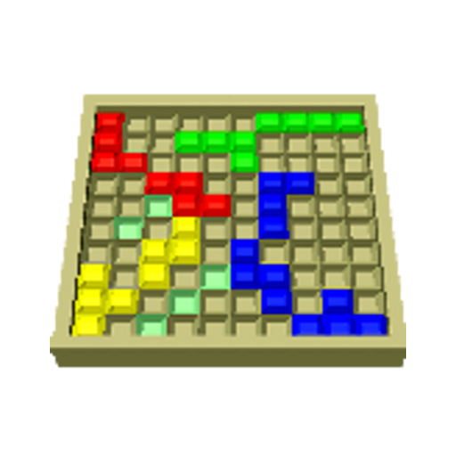</a></p> 
<h2 align="center"><b>Freebloks App for Android</b></h2>
<h4 align="center">Android port of <a href="https://github.com/shlusiak/freebloks-3d">Freebloks 3D</a></h4>
  
<p align="center">
    <a href="https://play.google.com/store/apps/details?id=de.saschahlusiak.freebloks" target="_blank">
        
    </a>
    <a href="http://www.amazon.com/Sascha-Hlusiak-Freebloks-3D/dp/B00CY8CLU8" target="_blank">
        
    </a>
    <a href="https://f-droid.org/packages/de.saschahlusiak.freebloks/">
        
    </a>
</p> 
  
<hr>
<p align="center"><a href="#screenshots">Screenshots</a> &bull; <a href="#description">Description</a> &bull; <a href="#getting-started">Getting Started</a> &bull; <a href="#support">Support</a> &bull; <a href="#license">License</a></p>
<p align="center"><a href="http://www.saschahlusiak.de/Freebloks-Android">Website</a> &bull; <a href="http://www.saschahlusiak.de/category/general/">Blog</a></p>
<hr>


## Screenshots
### Phone
[](fastlane/metadata/android/en-US/images/phoneScreenshots/shot_10.jpg)
[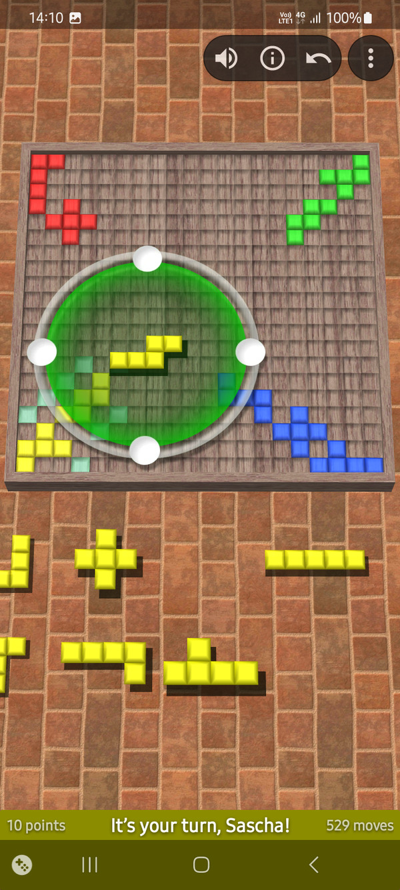](fastlane/metadata/android/en-US/images/phoneScreenshots/shot_20.jpg)
[](fastlane/metadata/android/en-US/images/phoneScreenshots/shot_30.jpg)
[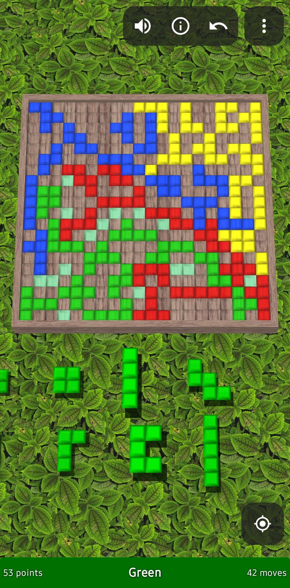](fastlane/metadata/android/en-US/images/phoneScreenshots/shot_40.jpg)
[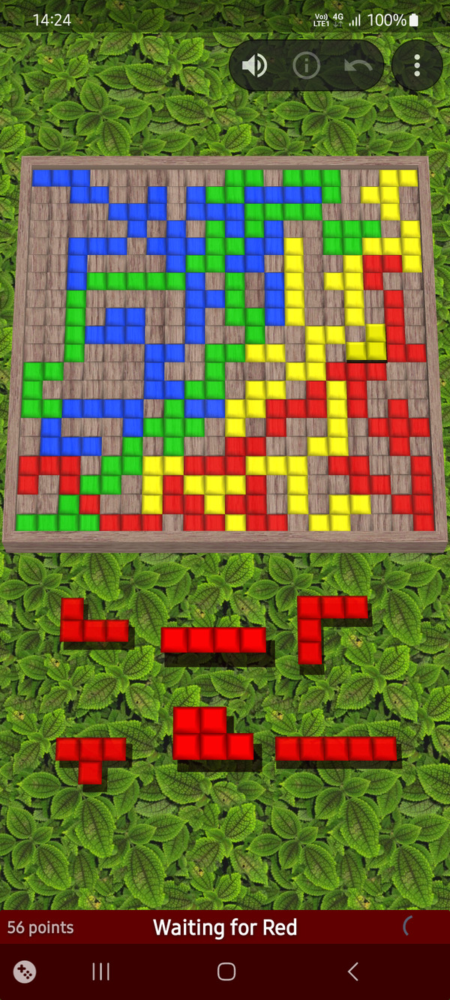](fastlane/metadata/android/en-US/images/phoneScreenshots/shot_50.jpg)
[](fastlane/metadata/android/en-US/images/phoneScreenshots/shot_60.jpg)
[](fastlane/metadata/android/en-US/images/phoneScreenshots/shot_70.jpg)
[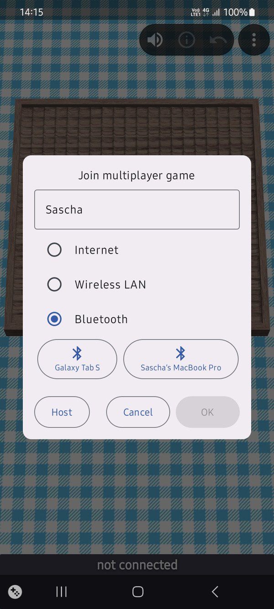](fastlane/metadata/android/en-US/images/phoneScreenshots/shot_80.jpg)
[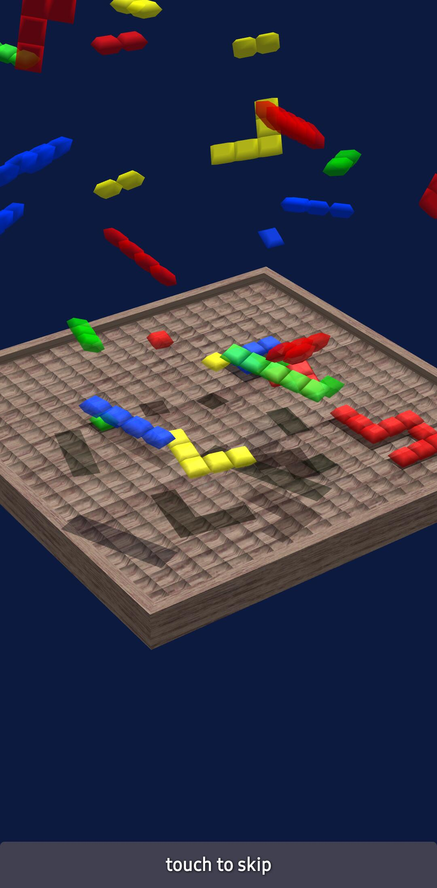](fastlane/metadata/android/en-US/images/phoneScreenshots/shot_90.jpg)

### Tablet
[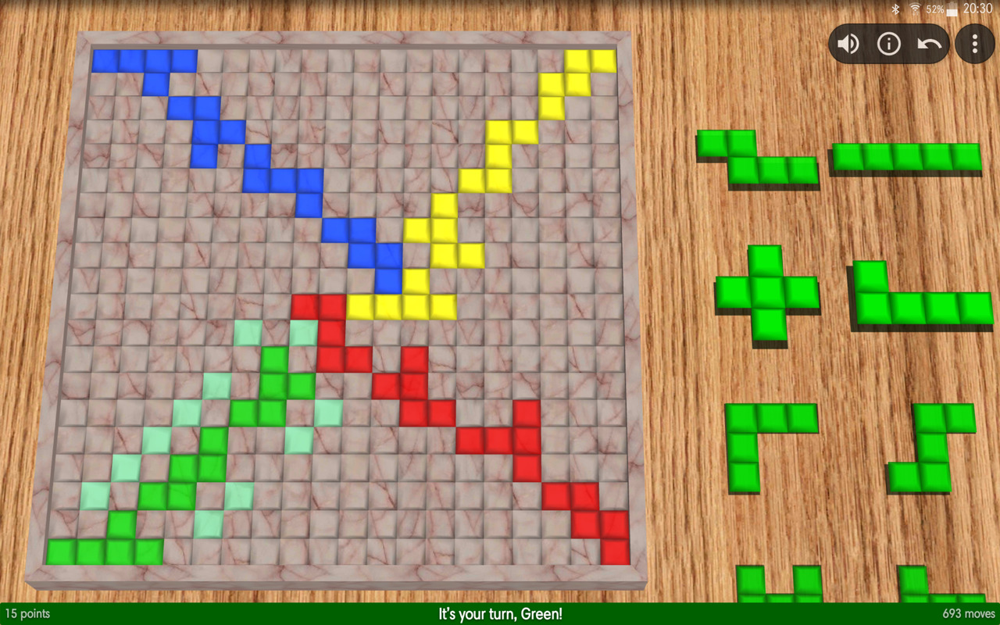](fastlane/metadata/android/en-US/images/tenInchScreenshots/tablet_10.jpg)
[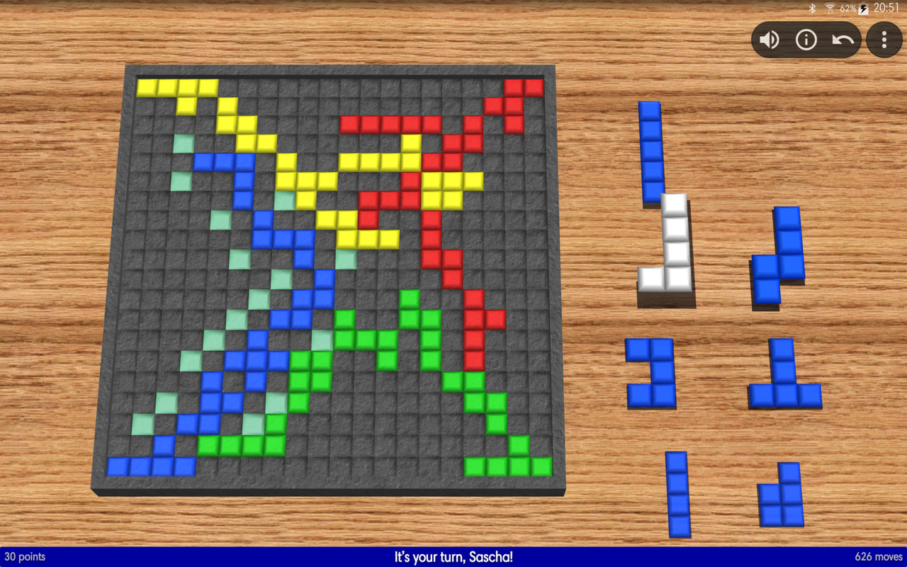](fastlane/metadata/android/en-US/images/tenInchScreenshots/tablet_20.jpg)
[](fastlane/metadata/android/en-US/images/tenInchScreenshots/tablet_30.jpg)
[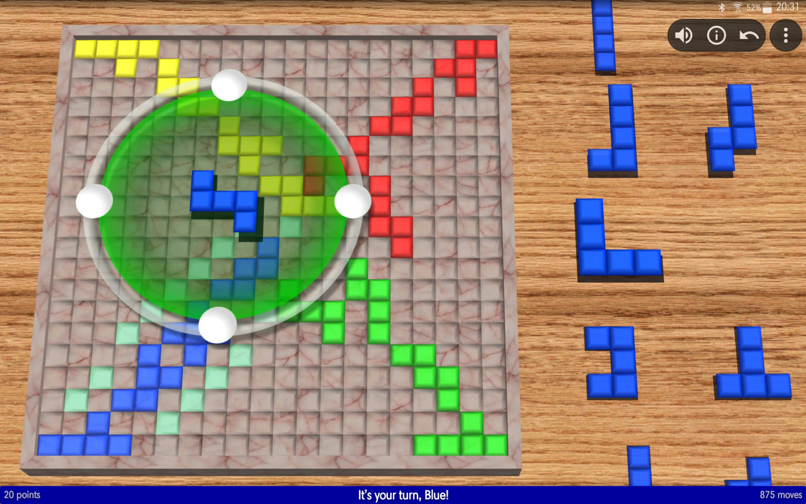](fastlane/metadata/android/en-US/images/tenInchScreenshots/tablet_40.jpg)
[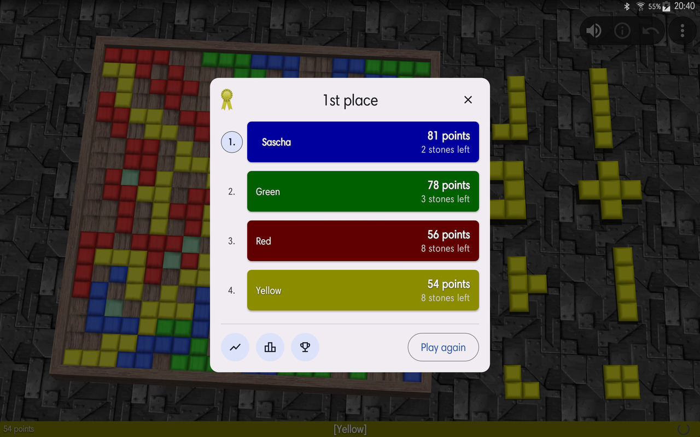](fastlane/metadata/android/en-US/images/tenInchScreenshots/tablet_50.jpg)
[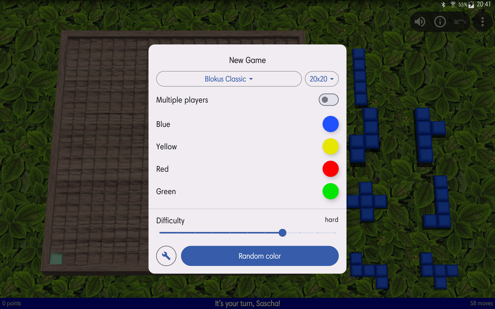](fastlane/metadata/android/en-US/images/tenInchScreenshots/tablet_60.jpg)
[](fastlane/metadata/android/en-US/images/tenInchScreenshots/tablet_70.jpg)
[](fastlane/metadata/android/en-US/images/tenInchScreenshots/tablet_80.jpg)

## Description

Try to place as many tiles on the board as possible, keeping in mind only two simple rules: your tiles must touch a corner of one of your previously placed tiles, but they must not share an edge. Can you play more tiles than your opponents? 

### RULES
Each player has 21 tiles: 12 tiles with 5 squares, 5 tiles with 4 squares, 2 tiles with 3 squares, 1 tile with 2 squares and 1 tile with 1 square. 
Players take turns in placing one tile onto the 20x20 board. The first tile for each player has to be placed in their corner of the board. Each following tile has to touch a corner of one of your previous tiles, but it must never share an edge. It may share edges with the opponents' tiles though. 

If a player has no more possible move, they have to pass. The game is over when no player can place a tile. 

For each player, the squares of all their tiles on the board are added up. Finishing a game with all stones placed on the board gives a 15 points bonus. If the monomino is placed last, you will get a 20 points bonus. The player with the most points wins. 


### HOW TO PLAY
- Swipe the list of available tiles with your finger.
- Select and drag a tile onto the board. 
- Rotate the stone using one of the 4 handles. 
- To flip a stone, slide your finger from one handle toward the opposing handle.
- Place the tile in the desired position. The tile will appear green if the position is valid, and red otherwise. Possible corners are highlighted on the board for convenience. 
- Tap the tile in a valid position to place it. 
- You can rotate the board at any time to see the opponents' tiles. 

Quit the app at any time, your current game will be saved and restored on next start. 


### FEATURES
- Supports 2-player modes, with 2 colors (Original, Blokus Duo and Blokus Junior), 4 colors (2 each).
- Customizable board sizes other than 20x20.
- Play against the computer or humans on the same device. 
- Play online against your friends
- Multiplayer via Bluetooth
- Hint and undo options
- Leaderboards and Achievements (Google Play Games)
- Looks great on tablets, too!

The game is network-compatible with Freebloks 3D for Windows and Linux.

## Getting started

This uses <a href="https://github.com/shlusiak/Freebloks-3D">shlusiak/Freebloks-3D</a> as a `git submodule` to build the backend. Make sure to initialise the submodule before building:

```
git submodule init
git submodule update
```

## Suppoer

Freebloks is free software. If you like Freebloks why not consider supporting the development? You can either purchase Freebloks VIP on Google Play, or support via Paypal.

<table>
  <tr>
    <td><a href="https://play.google.com/store/apps/details?id=de.saschahlusiak.freebloksvip">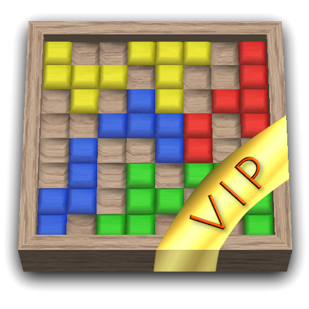</a></td>
    <td><a href="https://play.google.com/store/apps/details?id=de.saschahlusiak.freebloksvip"></a></td>
    <td><a href="https://play.google.com/store/apps/details?id=de.saschahlusiak.freebloksvip">https://play.google.com/store/apps/details?id=de.saschahlusiak.freebloksvip</a></td>
  </tr> 
  <tr>
    <td><a href="https://paypal.me/saschahlusiak/3eur"></a></td>
    <td><a href="https://paypal.me/saschahlusiak/3eur"></a></td>
    <td><a href="https://paypal.me/saschahlusiak/3eur">https://paypal.me/saschahlusiak/3eur</a></td>
  </tr>
</table>


## License

Freebloks is Free Software: You can use, study share and improve it at your
will. Specifically you can redistribute and/or modify it under the terms of the
[GNU General Public License](https://www.gnu.org/licenses/gpl.html) as
published by the Free Software Foundation, either version 2 of the License, or
(at your option) any later version.

Freebloks for Android is Copyright (c) by Sascha Hlusiak, 2012-2025.

Email: apps@saschahlusiak.de<br/>
<br/>
Project homepage: http://www.saschahlusiak.de/freebloks-3d-android/
<br/>
GitHub: https://github.com/shlusiak/Freebloks-Android

